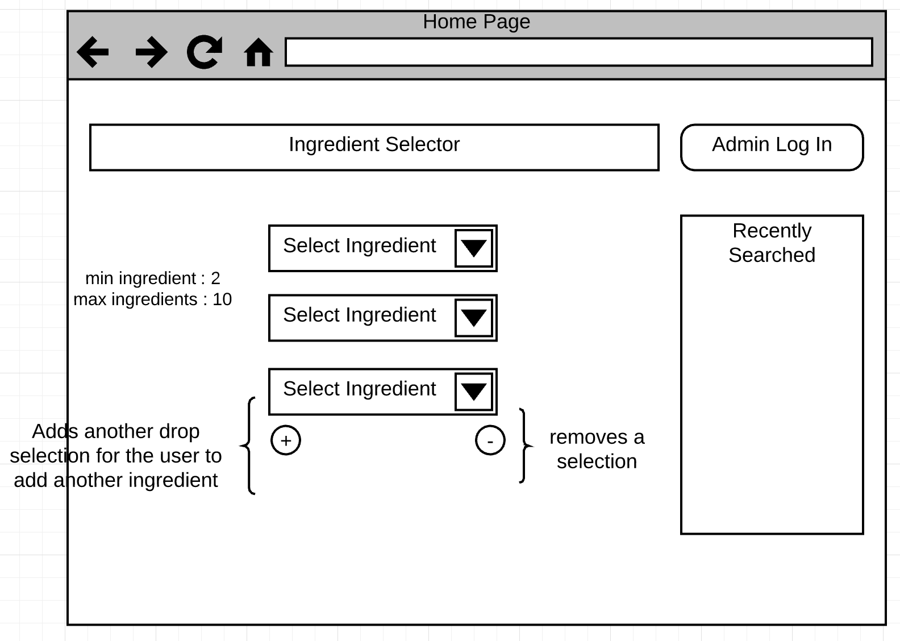
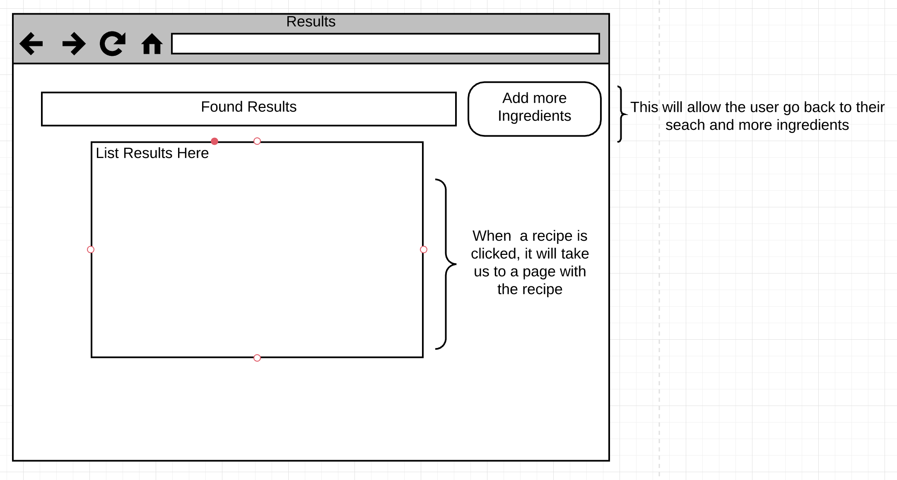
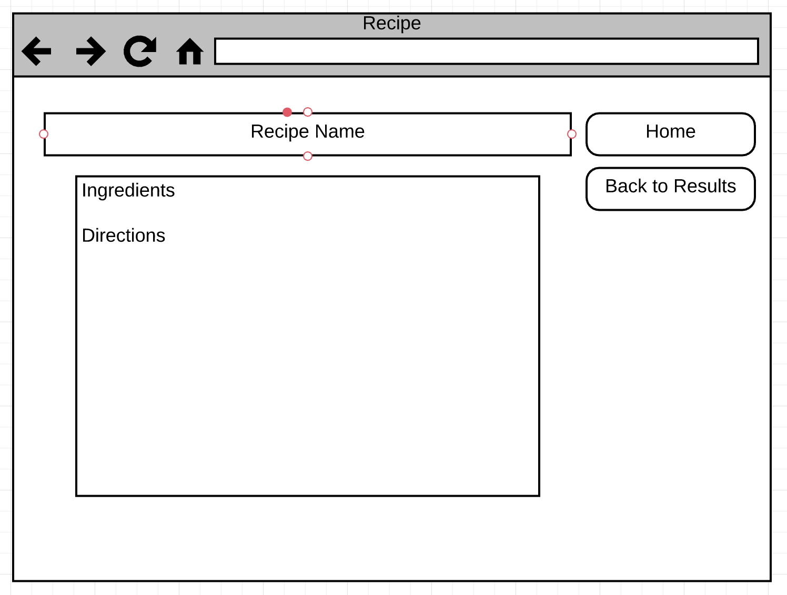
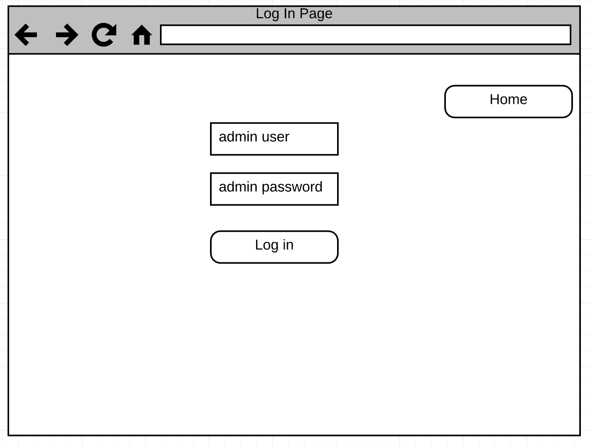
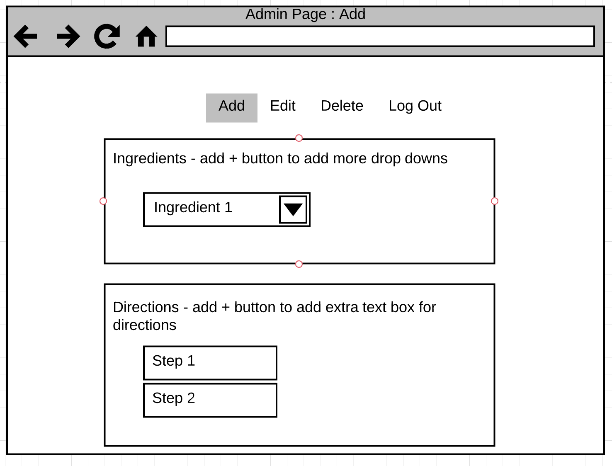
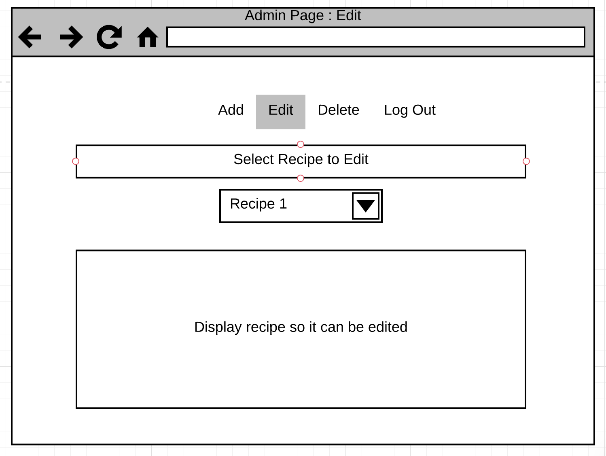
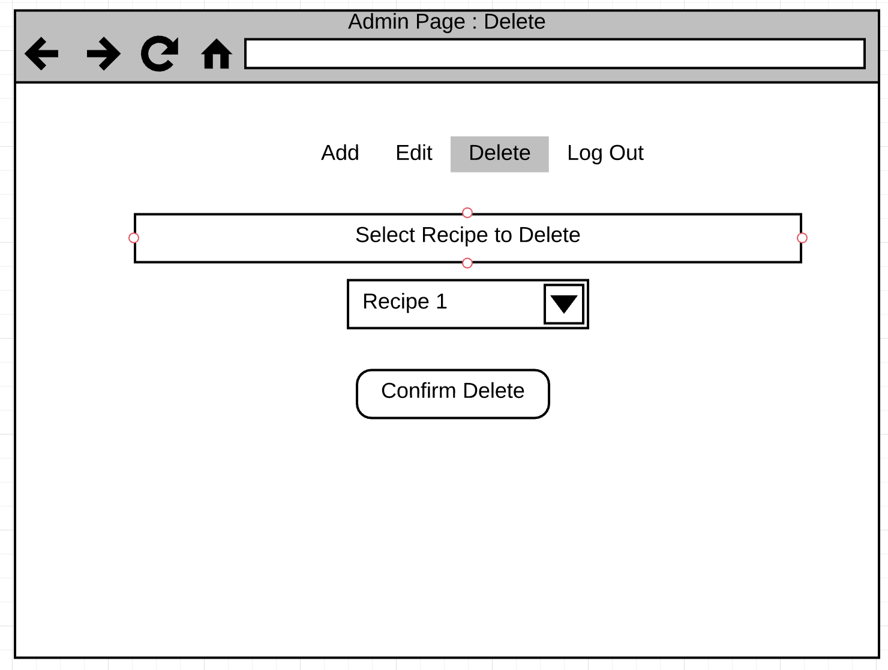
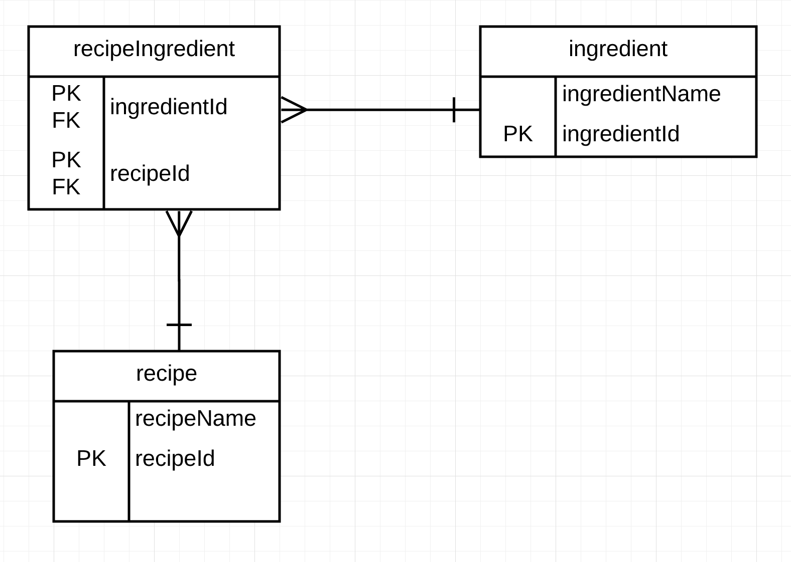

# CST-336-Final-Group Project
[Heroku Link](https://reverse-recipe-book.herokuapp.com/)
## Project Description
This project idea came from my passion of cooking. Users are able to input their ingredients and search for a recipe from an API source. There is an administrator side to this website that interacts with a MySQL database. Here the administrator can create, edit, or delete records. 

## Sprint 1 ()
**User Story**:
>As a user I want to be able to search for recipes with their choice of ingredients.

**Definition Of Done**:
- [ ] Home Page: Search with Ingredients
    - *Create the function that takes in all the entered ingredient items and search for it in the database*
    - *This function needs to account for 2 - 10 inputs/parameters*
- [ ] Database: Pull from API
    - *Create the database that pulls from the api which gives us our recipes*
- [ ] Database: Save search history
    - *Create the function that will save the search so that we can display it into recently searched*
- [ ] Database: Overall Ingredients
    - *Create the function that allows users to click on a drop menu that allows them to add more ingredients (this will allow users to refine their search a little bit more)*
- [ ] Results Page: Add More Ingredients 
    - *Create the database that contains the overall ingredients*
- [ ] Home page: Passing user input
    - *Create code that will pull the users input to pass to the correct functions (would this be considered routing?)*

**Notes**:
>These next tasks can be pushed to Sprint 2 if we are unable to get to it. 
- [ ] Create the home page
    - [ ] Drop down items for ingredients should auto-populate from our database
    - [ ] Plus and Minus buttons to add more drop down item options
    - [ ] Admin log in button  
- [ ] Create the result page
- [ ] Create the recipe page
- [ ] Create the log in page
- [ ] Create the admin page that allows for:
    - [ ] Adding a recipe
    - [ ] Editing a recipe
    - [ ] Deleting a recipe

## Sprint 2 ()
**User Story**:
>As an admin user I want to be able to edit, delete, and add new recipes. 
 

**Definition Of Done**:

- [ ] Create a log in function
    - [ ] Data validation 
- [ ] Create a function that adds a new recipe into the database
- [ ] Create a function that deletes a recipe from the database
- [ ] Create a function that edits a recipe from the database

## Project proposal/description:
[Create a web page where a user can select ingredients they have for a recipe ]

## Screenshot(s):

## Mockups
**Documentation Charts**
>- To edit the mockups or ERD on Lucid Chart click [here](https://www.lucidchart.com/invitations/accept/91459d83-f7a1-4780-81fb-c820a58c2842)
>

## ERD Diagram:

